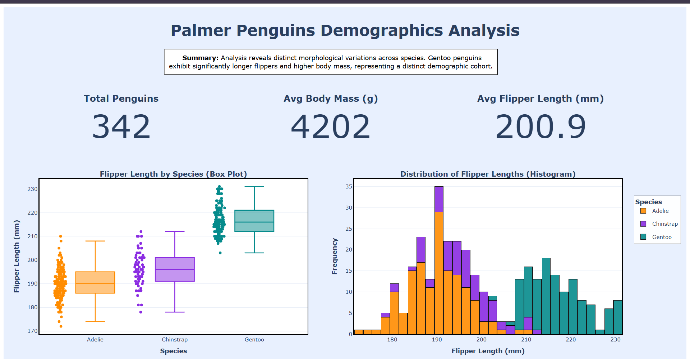

# Task 1 — Palmer Penguins Demographics Analysis

This task explores the Palmer Penguins dataset to understand how morphological traits — flipper length, body mass, and related physical measurements — vary across the three penguin species, surfaced through an interactive Plotly dashboard rather than a set of static charts.

---

## Dashboard Preview

*Full-page interactive dashboard: KPI summary cards, a species-wise flipper length boxplot, and a stacked distribution histogram.*

---

## What it does

1. **Loads and explores** the Palmer Penguins dataset across its three species: Adelie, Chinstrap, and Gentoo.
2. **Analyzes morphological spread** — how flipper length, body mass, and other continuous variables differ by species, and where those distributions overlap.
3. **Builds an interactive dashboard** in Plotly instead of static matplotlib output, so the analysis can be explored (hover, zoom, filter) rather than just viewed.

---

## Key Findings

**Species distinction:** Gentoo penguins form a clearly separate demographic cohort — significantly larger flipper length and body mass than both Adelie and Chinstrap. Adelie and Chinstrap, by contrast, show meaningful overlap in their physical measurements, making them harder to distinguish on size alone.

---

## Visualizations

### 1. Flipper Length Boxplot — Statistical Spread & Outliers
Shows the median, interquartile range, and outliers of flipper length for each species side by side — the fastest way to compare physical scale across the population at a glance.

### 2. Species Variance Stacked Histogram — Continuous Distribution
Shows the full distribution and frequency of flipper lengths, stacked by species. This is what reveals *where* Adelie and Chinstrap overlap, versus the clean separation of the Gentoo population from the other two.

### 3. KPI Summary Cards
Dashboard-level cards tracking average metrics and total sample counts across the population, giving a quick numeric anchor before diving into the distribution charts.

---

## Pipeline Overview

| Step | What happens |
|---|---|
| 1. Load data | Load the Palmer Penguins dataset |
| 2. Clean | Handle missing values across morphological columns |
| 3. Analyze | Compute species-wise summary statistics for flipper length, body mass, and related measurements |
| 4. Visualize | Build the boxplot, stacked histogram, and KPI cards as a single interactive Plotly dashboard |
| 5. Export | Save the dashboard as a standalone HTML file |

---

## Files in this folder

| File | Purpose |
|---|---|
| `task_01_penguins_distribution.py` | Full pipeline: data processing and dashboard generation |
| `Task_01_Penguins_Dashboard.html` | Exported full-page interactive dashboard — open in any browser |
| `Screenshot_penguins_dashboard.png` | Dashboard preview image used in this README |

---

## Tools Used

| Tool | Purpose |
|---|---|
| **Python 3** | Core pipeline language |
| **pandas** | Data loading and cleaning |
| **Plotly** | Interactive dashboard — boxplot, stacked histogram, and KPI cards |

---
